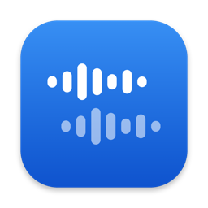
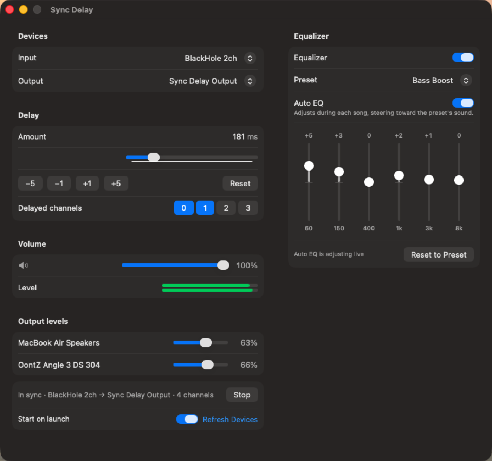

<p align="center"></p>

<h1 align="center">Sync Delay</h1>

<p align="center">Play your Mac's audio through several speakers at once — and keep them in time.</p>

<p align="center"></p>

## The problem

macOS can send audio to more than one output with a Multi-Output or Aggregate Device, but the outputs rarely arrive together. Bluetooth speakers typically lag the built-in speakers by 150–300 ms, which turns music into an echo.

Sync Delay fixes that by delaying the *faster* speakers until they line up with the slow ones.

## Features

- **Per-channel delay** — pick which output channels get delayed (e.g. the MacBook speakers) and tune the offset to the millisecond, live, by ear.
- **Master volume and mute** — smooth, click-free gain on everything Sync Delay plays.
- **Per-speaker volume** — set the hardware volume of each device inside your aggregate output, right from the app.
- **6-band equalizer with presets** — Flat, Bass Boost, Vocal, Rock, Electronic, Acoustic, Podcast, Late Night, or your own curve.
- **Auto EQ** — listens to the song as it plays and gradually adjusts the bands so each track lands on the sound of the preset you chose.
- **Built-in updates**: new releases install from inside the app.
- **Level meters**, hot-plug device detection, start-on-launch, and all settings remembered.

## How it works

```
Apps ──▶ BlackHole 2ch ──▶ Sync Delay ──▶ Aggregate Device
         (system output)   (EQ + delay)    ├─ ch 0-1  MacBook speakers  (delayed)
                                           └─ ch 2-3  Bluetooth speaker (live)
```

Sync Delay captures system audio from [BlackHole](https://github.com/ExistentialAudio/BlackHole), runs it through the EQ, and writes it to every channel of an aggregate device. Channels you mark as delayed read from further back in a lock-free ring buffer.

## Setup

1. **Install BlackHole 2ch**: `brew install blackhole-2ch` (or download from [existential.audio](https://existential.audio/blackhole/)).
2. **Create an Aggregate Device** in **Audio MIDI Setup** (`/Applications/Utilities`): click **+ → Create Aggregate Device** and tick your speakers — for example *MacBook Speakers* and your Bluetooth speaker. Set the built-in speakers as the clock source and enable **Drift Correction** on the others. The order you tick them sets the channel numbers (first device = channels 0-1, second = 2-3).
3. **Set your Mac's sound output to BlackHole 2ch** (System Settings → Sound → Output).
4. **Open Sync Delay**, choose *BlackHole 2ch* as the input and your aggregate as the output, and press **Start** (⌘↩). Allow microphone access when asked — macOS requires it to read from BlackHole.
5. **Tune**: light up the channels of the speaker that plays *early* and adjust the delay until clicks and drum hits land together. ⌘← / ⌘→ nudge by 1 ms; ⌥⌘← / ⌥⌘→ by 5 ms.

> **Volume tip:** once the system output is BlackHole, the menu-bar volume no longer reaches your speakers. Use the **Output levels** sliders in Sync Delay to set each speaker's volume.

## Install

Download `Sync-Delay.zip` from the [latest release](../../releases/latest), unzip it, and drag **Sync Delay.app** to Applications.

The app is ad-hoc signed, not notarized, so the first time macOS will block it. Right-click the app → **Open** → **Open**, or run:

```bash
xattr -dr com.apple.quarantine "/Applications/Sync Delay.app"
```

Requires macOS 13 Ventura or later.

## Build from source

Needs the Xcode command-line tools (`xcode-select --install`).

```bash
./build-app.sh
```

This compiles `sync-delay.swift` into `Sync Delay.app`. The whole app is a single Swift file using SwiftUI, Core Audio and AudioToolbox; there are no dependencies.

## Updates

Sync Delay checks this repo's latest release each time it launches. When a newer version exists, an **Install & Relaunch** button appears in the window; it downloads the release, replaces the app in place and reopens it. You can also check any time from the app menu: **Sync Delay → Check for Updates…**

### Publishing a new version (maintainers)

```bash
./release.sh 1.4 "Short description of what changed"
```

The script bumps the version in `SyncDelay-Info.plist`, builds and zips the app, commits, tags `v1.4`, pushes, creates the GitHub release with `Sync-Delay.zip` attached, and updates your local `/Applications` copy. Every installed copy picks it up on its next launch. Omit the notes to have GitHub generate them from commits.

## Troubleshooting

| Symptom | Fix |
| --- | --- |
| Silence | Make sure the Mac's sound output is BlackHole 2ch and something is playing; check the Level meter. |
| "Microphone access is required" | System Settings → Privacy & Security → Microphone → enable Sync Delay. |
| Delayed channels error | Your aggregate has fewer channels than selected — light only channels that exist. |
| Still out of sync | The *early* speaker must be the delayed one. Try lighting the other speaker's channels instead. |
| Crackles | Enable Drift Correction for non-clock devices in Audio MIDI Setup. |

For diagnostics, launch with `SYNCDELAY_DEBUG=1` to log buffer underruns/overruns.

## License

[MIT](LICENSE)
